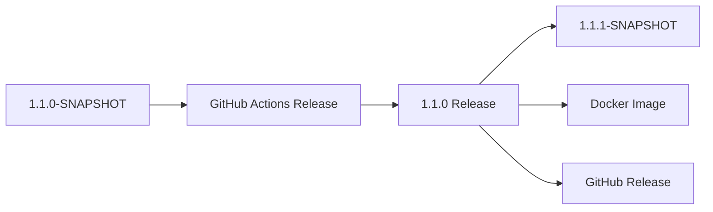

# FHIR Aggregator Mediator

An [OpenHIM](https://openhim.org/) mediator that aggregates FHIR R4 search results from multiple FHIR servers into a single endpoint. Designed for use with [google/fhir-data-pipes](https://github.com/google/fhir-data-pipes) to sync data from multiple sources to a shared FHIR store through a single pipeline.

> **Note:** This component is intended for **demo/test environments** where multiple EMR instances run on a single machine sharing one data pipeline. In production, each facility runs its own pipeline instance pointing at its own EMR — the aggregator is not needed. See [Production vs Demo Architecture](#production-vs-demo-architecture) below.

## Problem

google/fhir-data-pipes supports a single `fhirServerUrl` as its data source. In **demo/test setups** where multiple EMR instances run on one machine, you'd need to run a separate pipeline instance per server. This mediator presents all servers as a single FHIR endpoint, allowing one pipeline to sync data from all instances.

## Compatible Sources

The mediator works with **any FHIR R4 server** that returns standard search Bundles:

- **OpenMRS** with the [FHIR2 module](https://wiki.openmrs.org/display/projects/FHIR+Module) (including iSantePlus)
- **HAPI FHIR** servers
- **Any FHIR R4 compliant server** that supports `_getpages` pagination

Sources can be mixed — you can aggregate an OpenMRS instance, a HAPI FHIR server, and any other FHIR R4 server in the same configuration.

## How It Works

```
                        ┌─────────────────┐
                        │  FHIR Server 1  │
                        │  (Facility A)   │
┌──────────────┐        ├─────────────────┤        ┌──────────────┐
│  fhir-data-  │  GET   │  FHIR Server 2  │  PUT   │              │
│  pipes       │──────> │  (Facility B)   │──────> │  HAPI FHIR   │
│  pipeline    │        ├─────────────────┤        │  (SHR)       │
│              │        │  FHIR Server 3  │        │              │
└──────────────┘        │  (Facility C)   │        └──────────────┘
       │                ├─────────────────┤               ▲
       │                │  FHIR Server N  │               │
       │                │  (Facility ...)  │               │
       │                └─────────────────┘               │
       │                        ▲                         │
       │                        │                         │
       ▼                        │                         │
┌──────────────────────────────────────┐                  │
│        FHIR Aggregator Mediator      │                  │
│                                      │                  │
│  1. Receives FHIR search request     │                  │
│  2. Fans out to all sources          │                  │
│  3. Merges results from all sources  │                  │
│  4. Handles offset-based pagination  │──────────────────┘
│  5. Returns unified Bundle           │   (pipeline writes
│                                      │    to sink FHIR store)
└──────────────────────────────────────┘
```

1. Pipeline sends a FHIR search to the aggregator (e.g., `GET /fhir/Patient?_count=100`)
2. Aggregator fans out the request to all configured sources in parallel
3. Responses are merged into a single Bundle
4. Pipeline uses offset-based pagination (`_getpages` + `_getpagesoffset`) to fetch all pages
5. Pipeline writes the aggregated data to the sink FHIR store

## Quick Start

### Docker

```bash
docker build -t fhir-aggregator-mediator .
docker run -p 3000:3000 fhir-aggregator-mediator
```

### Docker Swarm

```bash
docker stack deploy -c docker-compose.yml fhir-aggregator
```

### Verify

```bash
# Health check — shows per-source status
curl http://localhost:3000/health

# FHIR metadata
curl http://localhost:3000/fhir/metadata

# Search patients across all sources
curl http://localhost:3000/fhir/Patient?_count=20
```

## Setup & Configuration Guide

This section walks through how to configure a full deployment with the FHIR Aggregator Mediator sitting between your FHIR servers and a data pipeline (or any FHIR client).

All runtime configuration lives in `config/config.json`. Edit this file to match your environment — no code changes are needed.

### Step 1 — Define Your FHIR Sources

Add every FHIR server you want to aggregate to the `sources` array. Each entry requires:

| Field | Description |
|-------|-------------|
| `id` | A unique short identifier (used in logs, health endpoint, and environment variable overrides) |
| `name` | A human-readable label |
| `baseUrl` | The FHIR R4 base URL (must end at the FHIR root, e.g. `/fhir` or `/openmrs/ws/fhir2/R4`) |
| `username` | HTTP Basic Auth username (leave empty `""` if the source requires no authentication) |
| `password` | HTTP Basic Auth password (leave empty `""` if no authentication) |

```json
{
  "sources": [
    {
      "id": "facility-a",
      "name": "Facility A (OpenMRS)",
      "baseUrl": "http://openmrs-a:8080/openmrs/ws/fhir2/R4",
      "username": "admin",
      "password": "Admin123"
    },
    {
      "id": "facility-b",
      "name": "Facility B (HAPI FHIR)",
      "baseUrl": "http://hapi-fhir-b:8080/fhir",
      "username": "",
      "password": ""
    },
    {
      "id": "facility-c",
      "name": "Facility C (OpenMRS)",
      "baseUrl": "http://openmrs-c:8080/openmrs/ws/fhir2/R4",
      "username": "admin",
      "password": "Admin123"
    }
  ]
}
```

On startup the mediator validates every source by hitting its `/metadata` endpoint. If any source is unreachable or returns an error (including 401/403 auth failures), it will retry for up to 15 minutes (useful when upstream EMRs are still booting) and then exit with a clear error if validation still fails.

#### Environment Variable Overrides for Credentials

To avoid storing passwords in the config file, you can override credentials per source via environment variables:

```
SOURCE_{id}_USERNAME=admin
SOURCE_{id}_PASSWORD=s3cret
```

For example, given a source with `"id": "facility_a"`:

```bash
export SOURCE_facility_a_USERNAME=admin
export SOURCE_facility_a_PASSWORD=s3cret
```

> **Note:** The source `id` becomes part of the environment variable name. Use underscores rather than hyphens in source IDs so that the resulting variable names are portable across all shells (e.g. `facility_a` instead of `facility-a`).

This is especially useful for Docker deployments where you pass secrets through the environment or orchestrator secrets management:

```bash
docker run -p 3000:3000 \
  -e SOURCE_facility_a_PASSWORD=s3cret \
  -e SOURCE_facility_b_PASSWORD=other-secret \
  fhir-aggregator-mediator
```

### Step 2 — Configure the Application Port

```json
{
  "app": {
    "port": 3000
  }
}
```

The mediator listens on port `3000` by default. Change this if the port conflicts with other services in your stack.

### Step 3 — Configure OpenHIM Registration (Optional)

The mediator registers itself with [OpenHIM](https://openhim.org/) on startup and creates an HTTP channel at `/aggregated-fhir`. This is **optional** — the mediator works standalone at `http://localhost:3000/fhir` without OpenHIM.

```json
{
  "mediator": {
    "api": {
      "username": "root@openhim.org",
      "password": "instant101",
      "apiURL": "https://openhim-core:8080",
      "trustSelfSigned": true,
      "urn": "urn:mediator:fhir-aggregator"
    }
  }
}
```

| Field | Description |
|-------|-------------|
| `username` | OpenHIM admin username |
| `password` | OpenHIM admin password |
| `apiURL` | OpenHIM Core API URL |
| `trustSelfSigned` | Accept self-signed TLS certificates from OpenHIM (set `true` for development) |
| `urn` | Unique mediator URN registered with OpenHIM |

The channel configuration is defined in `config/mediator.json`. It maps incoming requests at `/aggregated-fhir` to the mediator's `/fhir` endpoint and restricts access to the `shr-pipeline` client:

```json
{
  "urn": "urn:mediator:fhir-aggregator",
  "version": "1.0.0",
  "name": "FHIR Aggregator",
  "defaultChannelConfig": [
    {
      "methods": ["GET"],
      "urlPattern": "^/aggregated-fhir.*$",
      "routes": [
        {
          "host": "fhir-aggregator",
          "port": 3000,
          "pathTransform": "s/\\/aggregated-fhir/\\/fhir/g",
          "primary": true
        }
      ],
      "allow": ["shr-pipeline"]
    }
  ]
}
```

If OpenHIM is unreachable at startup the mediator logs a warning and continues running — it does not block.

### Step 4 — Tune Performance Settings

```json
{
  "performance": {
    "timeoutMs": 30000,
    "maxSocketsPerSource": 5,
    "rejectUnauthorized": true
  }
}
```

| Field | Default | Description |
|-------|---------|-------------|
| `timeoutMs` | `30000` | Per-source HTTP request timeout in milliseconds. Increase for slow sources. |
| `maxSocketsPerSource` | `5` | Maximum concurrent TCP connections per upstream source. Connection pooling with keep-alive is enabled automatically. |
| `rejectUnauthorized` | `true` | Set to `false` to accept self-signed TLS certificates from upstream FHIR servers (development only). |

There is also a request-level timeout at the Express layer (`requestTimeoutMs`, default `120000` ms) that guards against slow upstreams hanging the HTTP response indefinitely. If a request exceeds this limit the mediator returns HTTP 504 with a FHIR OperationOutcome. To override the default, add `requestTimeoutMs` to the `performance` section:

```json
{
  "performance": {
    "timeoutMs": 30000,
    "requestTimeoutMs": 120000,
    "maxSocketsPerSource": 5,
    "rejectUnauthorized": true
  }
}
```

### Step 5 — Configure Pagination Cache

Pagination state (per-source `_getpages` tokens) is stored in an in-memory LRU cache:

```json
{
  "pagination": {
    "cacheMaxSize": 1000,
    "cacheTtlMs": 3600000
  }
}
```

| Field | Default | Description |
|-------|---------|-------------|
| `cacheMaxSize` | `1000` | Maximum concurrent pagination sessions before the oldest is evicted |
| `cacheTtlMs` | `3600000` | Token expiry in milliseconds (default: 1 hour). Set this longer than your longest pipeline run. |

### Step 6 — Enable Clustering (Optional)

By default, the mediator runs as a single Node.js process. For production workloads with CPU-intensive dedup or large fan-out operations, you can enable clustering to fork one worker per CPU core. Each worker runs its own Express server and LRU pagination cache, sharing the same port via the Node.js `cluster` module.

#### Configuration

Add a `cluster` section to `config/config.json`:

```json
{
  "cluster": {
    "enabled": true,
    "workers": 4
  }
}
```

| Field | Default | Description |
|-------|---------|-------------|
| `enabled` | `false` | Set to `true` to fork multiple worker processes |
| `workers` | `os.cpus().length` | Number of worker processes. Set to `0` or omit to use all available CPU cores. |

#### Environment Variable Overrides

You can also enable clustering via environment variables (these take precedence over `config.json`):

```bash
# Enable clustering
export CLUSTER_ENABLED=true

# Optionally set worker count (defaults to CPU count)
export CLUSTER_WORKERS=4
```

Docker example:

```bash
docker run -p 3000:3000 \
  -e CLUSTER_ENABLED=true \
  -e CLUSTER_WORKERS=4 \
  fhir-aggregator-mediator
```

#### How It Works

- The **primary process** forks worker processes and monitors them. If a worker exits unexpectedly, it is automatically restarted.
- Each **worker process** runs a full Express server with its own LRU pagination cache, FHIR client, and source monitor.
- Workers share the same port via the OS kernel (round-robin on Linux, OS-level distribution on macOS/Windows).
- The in-process pagination cache is per-worker by design. Since each worker can independently re-fetch pages from upstream sources, stateless pagination remains correct even when consecutive requests land on different workers.

#### Alternatives: Running Multiple Replicas

Instead of (or in addition to) Node.js clustering, you can run multiple container replicas behind a load balancer:

- **Docker Swarm**: Set `replicas: N` in `docker-compose.yml`
- **Kubernetes**: Set `replicas: N` in your Deployment spec
- **OpenHIM**: Already supports load balancing across multiple mediator instances

This approach is preferred when you need independent memory limits per replica or are already using container orchestration.

### Step 7 — Point Your Pipeline at the Aggregator

Configure the [fhir-data-pipes](https://github.com/google/fhir-data-pipes) pipeline to use the aggregator as its FHIR source in `application.yaml`:

```yaml
fhirdata:
  fhirServerUrl: "http://fhir-aggregator:3000/fhir"
  fhirServerUserName: ""
  fhirServerPassword: ""
```

The aggregator handles authentication to each upstream source internally — the pipeline itself does not need credentials.

### Full Configuration Reference

Below is a complete `config/config.json` showing every available option:

```json
{
  "app": {
    "port": 3000
  },
  "mediator": {
    "api": {
      "username": "root@openhim.org",
      "password": "instant101",
      "apiURL": "https://openhim-core:8080",
      "trustSelfSigned": true,
      "urn": "urn:mediator:fhir-aggregator"
    }
  },
  "sources": [
    {
      "id": "facility-a",
      "name": "Facility A (OpenMRS)",
      "baseUrl": "http://openmrs-a:8080/openmrs/ws/fhir2/R4",
      "username": "admin",
      "password": "Admin123"
    },
    {
      "id": "facility-b",
      "name": "Facility B (HAPI FHIR)",
      "baseUrl": "http://hapi-fhir-b:8080/fhir",
      "username": "",
      "password": ""
    }
  ],
  "pagination": {
    "cacheMaxSize": 1000,
    "cacheTtlMs": 3600000
  },
  "cluster": {
    "enabled": false,
    "workers": 0
  },
  "performance": {
    "timeoutMs": 30000,
    "requestTimeoutMs": 120000,
    "maxSocketsPerSource": 5,
    "rejectUnauthorized": true,
    "maxRetries": 3,
    "initialDelayMs": 500,
    "maxDelayMs": 5000
  },
  "circuitBreaker": {
    "failureThreshold": 5,
    "resetTimeoutMs": 30000
  },
  "rateLimiting": {
    "enabled": true,
    "windowMs": 60000,
    "maxRequests": 100
  },
  "compression": {
    "enabled": true,
    "threshold": 1024
  }
}
```

### Deploying with Docker Swarm

The included `docker-compose.yml` is designed for Docker Swarm. It injects both config files as Docker configs and attaches the mediator to the `openhim` and `isanteplus` overlay networks:

```bash
# Build the image
docker build -t fhir-aggregator-mediator .

# Deploy to the swarm
docker stack deploy -c docker-compose.yml fhir-aggregator
```

To customize configuration for your environment, edit `config/config.json` and `config/mediator.json` before deploying. Docker Swarm will mount them into the container at `/app/config/`.

Resource limits are set in the compose file (512 MB memory, 0.5 CPU) and can be adjusted to fit your deployment.

## API

### `GET /fhir/metadata`

Returns a synthetic CapabilityStatement listing all 161 supported FHIR R4 resource types.

### `GET /fhir/:resourceType?_count=N&_since=...`

Searches all configured sources in parallel, merges results, and returns a FHIR Bundle. All query parameters are passed through to each source. No deduplication is performed — duplicate resources from different sources are passed through as-is.

- `_count` — page size (default: 20, max: 500)
- `_since` — passed through for incremental sync

If results span multiple pages, the Bundle includes a `next` link with a `_getpages` token.

### `GET /fhir?_getpages=TOKEN&_getpagesoffset=N&_count=M`

Offset-based pagination. The token maps to per-source `_getpages` tokens stored in the LRU cache. The offset and count are forwarded to each source.

### `GET /health`

Returns per-source health status with circuit breaker state:

```json
{
  "status": "UP",
  "sources": [
    { "id": "facility-a", "status": "UP", "name": "Facility A", "lastError": null, "lastChecked": "...", "circuitBreaker": { "state": "CLOSED", "failures": 0 } },
    { "id": "facility-b", "status": "DOWN", "name": "Facility B", "lastError": "ECONNREFUSED", "lastChecked": "...", "circuitBreaker": { "state": "OPEN", "failures": 5 } }
  ]
}
```

Returns HTTP 200 when all sources are UP, HTTP 503 when any source is DOWN or AUTH_FAILED.

### `GET /ready`

Returns HTTP 200 when the mediator has completed startup source validation and is ready to serve requests. Returns HTTP 503 during the startup validation period. Use this as the Kubernetes readiness probe.

### `GET /metrics`

Returns Prometheus-compatible metrics in exposition format. Includes:
- `http_request_duration_seconds` — histogram of inbound request latency
- `http_requests_total` — counter of inbound requests by method/route/status
- `active_requests` — gauge of in-flight requests
- `upstream_request_duration_seconds` — histogram of upstream FHIR server latency
- `upstream_errors_total` — counter of upstream errors by source and error type
- `pagination_cache_size` — gauge of current cache entries
- `pagination_cache_hits_total` / `pagination_cache_misses_total` — counters
- Default Node.js metrics (GC, event loop, memory)

## Source Health Monitoring

### Startup Validation

On startup, the mediator validates credentials for every configured source by hitting `/metadata`. If any source is unavailable, the mediator retries for up to 15 minutes (90 attempts × 10 seconds) to allow slow-starting upstream services (e.g. iSantePlus) to boot. If validation still fails after all retries, the mediator **exits immediately** with a clear error message instead of silently serving incomplete data.

### Per-Request Tracking

When a source fails during a request, the response includes headers indicating which sources were unavailable:

```
X-Aggregator-Sources-Failed: facility-b,facility-c
X-Aggregator-Sources-Failed-Count: 2
```

This allows monitoring systems to detect degraded operation.

## Error Handling

| Scenario | Behavior |
|----------|----------|
| Source down during request | Warning logged, results from remaining sources returned, `X-Aggregator-Sources-Failed` header set |
| Source auth fails on startup | Mediator retries for up to 15 min, then exits with `FATAL: Source validation failed` |
| Source auth fails during request | Source marked as `AUTH_FAILED` in health, remaining sources still serve data |
| Circuit breaker OPEN | Source skipped entirely (no request sent, no timeout waited) until reset timeout expires |
| Transient upstream error (502/503/504) | Automatically retried up to 3 times with exponential backoff + jitter |
| Pagination token expired | HTTP 410 Gone returned, pipeline retries on next schedule |
| All sources down | Empty Bundle returned |
| Request timeout (>120 s) | HTTP 504 with FHIR OperationOutcome |
| Rate limit exceeded | HTTP 429 with FHIR OperationOutcome and `Retry-After` header |
| Invalid query parameter | HTTP 400 with FHIR OperationOutcome |

## Architecture

```
src/
  index.js            # Entry point — worker bootstrap, middleware setup, OpenHIM registration
  server.js           # Express app factory (shared by all workers)
  cluster.js          # Cluster manager — forks workers, auto-restarts on exit
  routes.js           # Request routing, Bundle construction, resource type & query validation
  aggregator.js       # Fan-out, merge, offset pagination, circuit breaker integration
  pagination.js       # LRU cache for pagination state tokens
  fhir-client.js      # HTTP client with Basic Auth, connection pooling, timeout, retry
  source-monitor.js   # Startup validation, per-request health tracking
  circuit-breaker.js  # Per-source circuit breaker (CLOSED→OPEN→HALF_OPEN)
  config-validator.js # Configuration validation and environment variable overrides
  logger.js           # Structured JSON logger (pino)
  metrics.js          # Prometheus metrics (prom-client)
config/
  config.json         # Runtime config (sources, performance, pagination, cluster, OpenHIM)
  mediator.json       # OpenHIM mediator registration metadata and channel config
k8s/
  deployment.yaml     # Kubernetes Deployment, Service, HPA, PDB
load-tests/
  k6-load-test.js     # k6 load test scenarios with SLOs
tests/
  unit/               # Unit tests (aggregator, pagination, source-monitor, fhir-client, circuit-breaker, config-validator, cluster)
  integration/        # Route tests via supertest
  fixtures/           # Reusable FHIR Bundles and mock sources
```

## Development

```bash
# Install dependencies
npm install

# Run tests (~110 tests, ~93% coverage)
npm test

# Run tests in watch mode
npm run test:watch

# Lint
npm run lint

# Auto-fix formatting
npm run format
```

## Environment Variables

All configuration can be overridden via environment variables for containerized deployments:

| Variable | Description | Default |
|----------|-------------|---------|
| `APP_PORT` | Server listen port | `3000` |
| `LOG_LEVEL` | Log level (fatal, error, warn, info, debug, trace) | `info` |
| `NODE_ENV` | Set to `development` for human-readable logs | — |
| `CLUSTER_ENABLED` | Enable Node.js clustering (`true`/`false`) | `false` |
| `CLUSTER_WORKERS` | Number of worker processes | CPU count |
| `SOURCE_{id}_USERNAME` | Override source username | — |
| `SOURCE_{id}_PASSWORD` | Override source password | — |
| `SOURCE_{id}_URL` | Override source base URL | — |
| `SOURCES` | Full sources array as JSON string | — |
| `OPENHIM_API_USERNAME` | OpenHIM API username | — |
| `OPENHIM_API_PASSWORD` | OpenHIM API password | — |
| `OPENHIM_API_URL` | OpenHIM API URL | — |
| `PERFORMANCE_TIMEOUT_MS` | Per-source request timeout | `30000` |
| `PERFORMANCE_MAX_SOCKETS_PER_SOURCE` | Max TCP connections per source | `5` |
| `PERFORMANCE_REQUEST_TIMEOUT_MS` | Express request-level timeout | `120000` |
| `PAGINATION_CACHE_MAX_SIZE` | Max pagination sessions | `1000` |
| `PAGINATION_CACHE_TTL_MS` | Pagination token TTL | `3600000` |
| `RATE_LIMIT_WINDOW_MS` | Rate limit window | `60000` |
| `RATE_LIMIT_MAX_REQUESTS` | Max requests per window | `100` |

## Kubernetes Deployment

Kubernetes manifests are provided in `k8s/`:

```bash
# Apply manifests
kubectl apply -f k8s/deployment.yaml

# Verify
kubectl get pods -l app=fhir-aggregator
```

The manifests include:
- **Deployment** with readiness/liveness probes (`/ready` and `/health`)
- **Service** (ClusterIP)
- **HorizontalPodAutoscaler** (70% CPU target, 2-10 replicas)
- **PodDisruptionBudget** (minAvailable: 1)

## Load Testing

See `load-tests/README.md` for instructions on running k6 load tests:

```bash
k6 run load-tests/k6-load-test.js
```

SLOs: p95 < 2s, p99 < 5s, error rate < 1%.

## Production vs Demo Architecture

### Production (each site has its own pipeline)

In production, each facility is a self-contained site with intermittent internet. Each site runs its own pipeline **No aggregator needed.**

### Demo/Test (multiple instances on one machine)

In demo/test environments, multiple iSantePlus instances run on a single machine with one shared pipeline. The aggregator presents all instances as one FHIR endpoint.

```
┌─────────────────────────────────────┐
│         Single Machine              │
│                                     │
│  iSantePlus 1 ──┐                   │
│                 ├──→ Aggregator     │
│  iSantePlus 2 ──┘     (:3000)      │
│                          │          │
│                       Pipeline      │
│                          │          │
│                       OpenHIM       │
│                       OpenCR        │
│                       SHR Mediator  │
│                       HAPI FHIR     │
└─────────────────────────────────────┘
```

### When to Use the Aggregator

| Scenario | Aggregator? |
|----------|-------------|
| Production: one iSantePlus per site, each with its own pipeline | **No** |
| Demo/test: multiple iSantePlus on one machine, one pipeline | **Yes** |
| Development: testing pipeline against multiple data sources | **Yes** |
| Training: simulating multi-facility setup on a laptop | **Yes** |

## Releasing

This project uses an automated release process through GitHub Actions that integrates with our SNAPSHOT-based versioning.

### Quick Release Process

1. **Go to [Release Action](https://github.com/mherman22/fhir-aggregator-mediator/actions/workflows/release-dispatch.yml)**
2. **Click "Run workflow"**
3. **Select version type:** patch/minor/major
4. **Click "Run workflow"** to start the release

That's it! The automation handles everything else.

### What Happens During a Release

The workflow automatically:
1. **Validation** - Ensures you're releasing from a SNAPSHOT version
2. **Testing** - Runs the full test suite
3. **Changelog Generation** - Creates changelog from [conventional commits](https://www.conventionalcommits.org/)
4. **Version Management**:
   - Removes `-SNAPSHOT` suffix for release (e.g., `1.1.0-SNAPSHOT` → `1.1.0`)
   - Creates git tag for the release
   - Bumps to next development version with `-SNAPSHOT` suffix
5. **GitHub Release** - Creates release with changelog and Docker image info
6. **Docker Image** - Automatically builds and pushes to GHCR

### Version Types

- **Patch** (`1.1.0-SNAPSHOT` → `v1.1.0` → `1.1.1-SNAPSHOT`): Bug fixes, small improvements
- **Minor** (`1.1.0-SNAPSHOT` → `v1.1.0` → `1.2.0-SNAPSHOT`): New features, backwards-compatible changes  
- **Major** (`1.1.0-SNAPSHOT` → `v1.1.0` → `2.0.0-SNAPSHOT`): Breaking changes

### Process Overview



### Changelog Generation

The workflow automatically parses conventional commits to generate structured changelogs:

- `feat:` → ✨ New Features
- `fix:` → 🐛 Bug Fixes  
- `docs:` → 📚 Documentation
- `refactor:` → ♻️ Refactoring
- `perf:` → ⚡ Performance
- `test:` → 🧪 Testing
- `chore:` → 🔧 Maintenance

### Alternative: GitHub CLI

If you prefer command line and have [GitHub CLI](https://cli.github.com/) installed:

```bash
# Patch release
gh workflow run release-dispatch.yml -f version_type=patch

# Minor release  
gh workflow run release-dispatch.yml -f version_type=minor

# Major release
gh workflow run release-dispatch.yml -f version_type=major

# Pre-release
gh workflow run release-dispatch.yml -f version_type=patch -f prerelease=true
```

### Pre-releases

You can mark releases as pre-releases by checking the "Mark as pre-release" option when triggering the workflow.

### Troubleshooting

**"Current version is not a SNAPSHOT"** - This means the current version in package.json doesn't end with `-SNAPSHOT`. Manually update package.json to the next SNAPSHOT version (e.g., `1.1.1-SNAPSHOT`).

**Release workflow failed** - Check the [Actions tab](https://github.com/mherman22/fhir-aggregator-mediator/actions) for detailed logs. Common issues: test failures, git conflicts, or permission issues.

**Need to hotfix a release** - Create a hotfix branch from the release tag, make the fix with conventional commit format, then run the release workflow.

> **Note**: Previously this project used a `release.sh` script. The GitHub Actions approach is more robust and provides better changelog generation.

### Pinning versions in downstream projects

Use a specific version tag in your docker-compose rather than `:latest`:

```yaml
image: ghcr.io/mherman22/fhir-aggregator-mediator:1.0.0
```

## License

MPL-2.0
